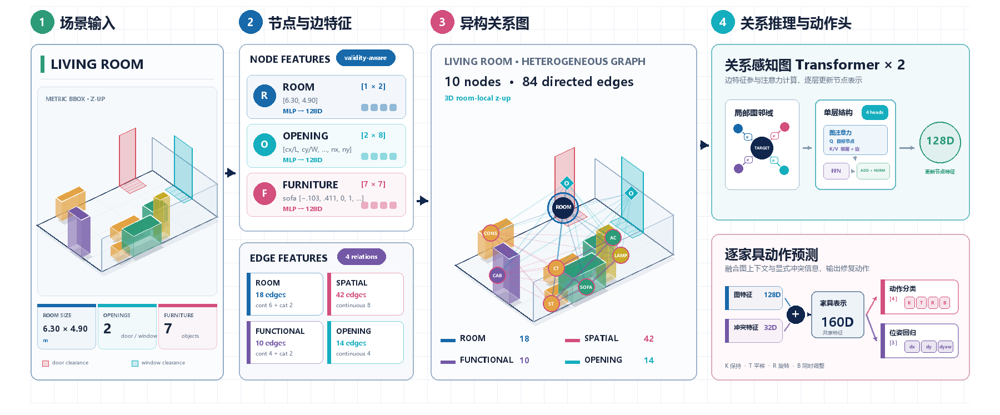
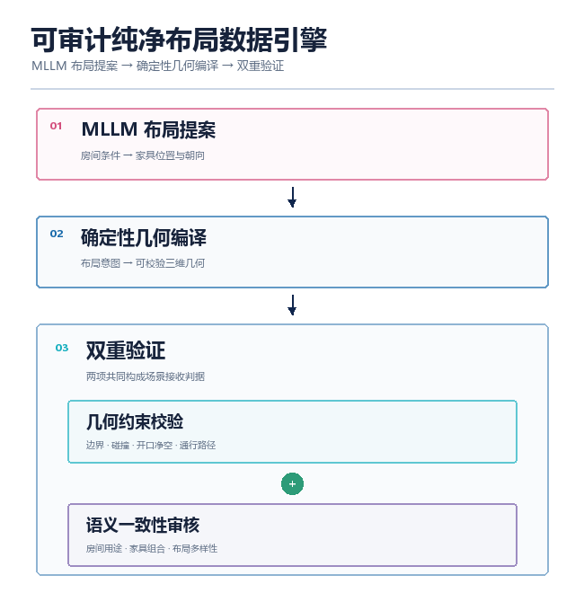

<div align="center">

# SceneRepair v3

**面向单房间 Furniture 阶段的关系感知三维场景修复**

Relation-aware 3D scene repair with auditable clean-layout data tooling.


</div>


SceneRepair v3 将房间、开口和家具编码为异构关系图，联合预测每件家具的修复动作与位姿增量，并在模型推理链路内完成硬约束和功能约束细化。仓库同时提供纯净布局数据生产、训练、评估、JSON-to-JSON 推理和结果审计工具。

> **当前里程碑：Furniture SFUR v10。** 在 52 个未参与训练的测试房间、每场 16 个确定性扰动组成的 832 个场景上，整场功能可用率达到 **90.5048%**，硬约束通过率达到 **100%**。

## 核心能力

- **关系感知建模**：显式建模 `ROOM`、`SPATIAL`、`FUNCTIONAL_PARTNER` 和 `OPENING` 四类关系，而不是把房间布局压缩成无结构向量。
- **整场联合修复**：对全部 Furniture 节点联合预测 `KEEP / TRANSLATE / ROTATE / BOTH` 与连续位姿增量。
- **可执行约束闭环**：4 轮 `dense_delta` 语义推理，每轮重新构图，再执行模型内硬约束层和功能细化层。
- **可审计推理**：JSON-to-JSON 接口保留 checkpoint、规则、动作范围、约束变化、累计位姿和 SFUR 子指标。
- **可追踪数据生产**：MLLM 负责逐场景布局意图，确定性代码负责编译、几何验证、语义复核和数据晋级。

## 冻结验收结果

| 指标 | 结果 |
|---|---:|
| Scene Functional Usability Rate (SFUR) | **753 / 832 = 90.5048%** |
| 硬约束通过率 | **832 / 832 = 100.0000%** |
| 平均功能综合分 | 0.967883 |
| 功能关系通过率 | 0.990986 |
| 使用净空通过率 | 0.935651 |
| 核心目标可达率 | 0.976042 |

冻结合同使用 `semantic_restore_v1 + dense_delta + 4 passes + functional refinement`，测试 seed 为 `20260802`。完整证据、分扰动规模结果和失败分析见 [SFUR v10 最终验收报告](docs/Furniture阶段SFUR_v10最终验收报告.md)；指标定义见 [SFUR v1 指标合同](docs/SFUR_v1指标合同.md)。

> SFUR 衡量冻结合同内的硬几何约束、功能关系、使用净空与核心路径可达性，不评价审美、风格或完整人类主观自然度，也不等同于 HLAR。

## 模型与推理链路



```text
Scene JSON
  -> type-specific node/edge encoding
  -> heterogeneous relation graph
  -> relation-aware graph Transformer x 2
  -> per-furniture action + pose delta
  -> dense_delta semantic pass x 4 (rebuild graph each pass)
  -> hard-constraint refinement
  -> functional refinement
  -> repaired JSON + hard/SFUR audit
```

默认主干为 `128 hidden / 4 heads / 32 per head / 2 layers`。当前合同支持单房间 Furniture 阶段，单场最多 17 件家具；坐标系为 `room_local_z_up`，四元数顺序为 `wxyz`。

## 快速开始

### 1. 安装

需要 Python 3.10-3.12。模型包的核心依赖由 `pyproject.toml` 管理：

```bash
git clone https://github.com/Hex671/SceneRepair_v3.git
cd SceneRepair_v3
python -m pip install -e ".[dev]"
```

纯净布局数据引擎还需要 OpenAI Python SDK：

```bash
python -m pip install openai
```

### 2. 验证安装

```bash
python -m pytest -q
python -m tools.smoke_furniture_network --max-translation-m 0.5 --max-yaw-deg 60
```

当前仓库基线为 `105 passed`。Smoke test 会构建一个小型异构图，执行前向传播、动作解码并输出 checkpoint 合同。

## JSON-to-JSON 推理

正式部署配置与输入/输出合同见 [SceneExpert Furniture 推理接口 v2](docs/SceneExpert_Furniture推理接口_v2_SFUR.md)。CLI 示例：

```bash
python -m tools.infer_furniture \
  --input path/to/scene_jsons \
  --output-dir path/to/repair_outputs \
  --checkpoint path/to/furniture_clean512_sfur_v10_final/best.pt \
  --vocab data/training/clean512_v1/furniture_vocab_clean512_v1.json \
  --functional-rules configs/functional_partner_rules_hssd_v1.json \
  --compatibility-rules configs/functional_partner_category_compatibility_v1.json \
  --sfur-rules configs/sfur_rules_v1.json \
  --batch-size 32 \
  --device auto
```

checkpoint 内置正式 deployment profile；加载后会自动选择 `dense_delta`、4 passes 和功能细化。完整 SFUR 模式要求输入显式包含：

```text
audit.use_clearance_zones
audit.path_targets
```

Python API：

```python
from scene_repair_v3 import FurnitureRepairEngine

engine = FurnitureRepairEngine.load(
    checkpoint="path/to/best.pt",
    vocab="data/training/clean512_v1/furniture_vocab_clean512_v1.json",
    functional_rules="configs/functional_partner_rules_hssd_v1.json",
    compatibility_rules=(
        "configs/functional_partner_category_compatibility_v1.json"
    ),
    sfur_rules="configs/sfur_rules_v1.json",
)

predictions = engine.repair_scene_jsons(scene_json_objects)
repaired_json = predictions[0].repaired_scene_json
audit = predictions[0].audit
```

输入对象不会被原地修改。功能细化未收敛时，runtime 会保留实际 SFUR 失败和具体 violations，不会伪造通过结果。

## 训练与评估

仓库包含训练 manifest、词表和规则；完整 clean512 场景及训练 checkpoint 未纳入 Git。恢复对应本地数据后，可从以下入口开始：

```bash
python -m tools.train_furniture --help
python -m tools.evaluate_sfur --help
python -m tools.evaluate_furniture --help
```

多卡训练使用：

```bash
torchrun --nproc_per_node=2 -m tools.train_furniture <training arguments>
```

`clean512_v1` 冻结了 512 个 accepted clean scenes，划分为 409 train / 51 val / 52 test，并固定了 category 词表、功能关系规则、动作范围和逐文件哈希。训练配置与数据合同见 [训练数据构造与训练计划](docs/Furniture阶段训练数据构造与训练计划_v1.md)。

## 纯净布局数据引擎



数据引擎采用“模型生成布局意图，代码执行确定性编译和验证”的职责分离：

1. MLLM 逐场景提出家具、位置、朝向意图和功能分组。
2. 编译器将语义意图转换为冻结坐标合同下的几何表示。
3. 验证器检查边界、碰撞、开口净空、路径、使用净空和功能关系。
4. 独立语义 reviewer 只给出 `pass / revise / reject`，不能静默修改布局。
5. 只有满足硬验证、多样性和独立审核的场景才能进入 accepted manifest。

本地 API 配置不会进入版本控制：

```bash
cp clean_layout_data_engine/config.example.json clean_layout_data_engine/config.json
python -m clean_layout_data_engine.batch_engine --help
```

请只在本机 `clean_layout_data_engine/config.json` 中填写凭据。该文件已被 `.gitignore` 排除，程序也不会把密钥复制到日志或数据产物。完整说明见 [纯净布局数据管线文档](clean_layout_data_engine/README.md)。

## 仓库结构

| 路径 | 内容 |
|---|---|
| `scene_repair_v3/` | 图合同、网络、损失、修复层、SFUR 与推理 API |
| `clean_layout_data_engine/` | 纯净布局编译、验证、审核和批处理编排 |
| `tools/` | 训练、评估、推理、数据准备和可视化工具 |
| `tests/` | 模型、图、推理、训练合同和 SFUR 测试 |
| `configs/` | 冻结词表、功能关系与 SFUR 规则 |
| `data/` | 小型 pilot、示例数据与 clean512 manifest/词表 |
| `docs/` | 设计、训练、验收、部署合同和预测示例 |
| `fig/` | 模型、数据、训练与应用图稿 |

## 数据与产物边界

仓库包含源码、测试、冻结规则、训练 manifest、小型 pilot 数据、文档和可视化示例。以下内容保持本地，不会提交：

- `clean_layout_data_engine/config.json` 与 `.env*`：API 凭据和本地环境配置；
- `runs/`、`*.pt`、`*.ckpt`：checkpoint、训练日志和评估产物；
- `data/clean_layout_production*/`：大规模生产批次和中间状态；
- cache、临时日志和编辑器元数据。

因此，仓库可以直接运行单元测试和网络 smoke test，但复现正式训练或 v10 冻结评估需要另行提供完整 clean512 场景与对应 checkpoint。

## 文档导航

| 主题 | 文档 |
|---|---|
| 最终能力与证据 | [SFUR v10 最终验收报告](docs/Furniture阶段SFUR_v10最终验收报告.md) |
| 推理部署 | [SceneExpert Furniture 推理接口 v2](docs/SceneExpert_Furniture推理接口_v2_SFUR.md) |
| 指标合同 | [SFUR v1 指标合同](docs/SFUR_v1指标合同.md) |
| 网络设计 | [新版网络结构设计](docs/Furniture阶段新版网络结构设计_v1.md) · [网络实现说明](docs/Furniture网络实现说明_v1.md) |
| 功能关系 | [FUNCTIONAL_PARTNER 冻结规则](docs/FUNCTIONAL_PARTNER冻结规则_v1.md) |
| 训练设计 | [训练数据构造与训练计划 v1](docs/Furniture阶段训练数据构造与训练计划_v1.md) · [v2](docs/Furniture阶段训练数据构造与训练计划_v2.md) |
| 阶段报告 | [clean512_v1](docs/Furniture阶段clean512_v1首轮训练报告.md) · [observable_v5](docs/Furniture阶段observable_v5训练报告.md) · [joint_v6](docs/Furniture阶段joint_v6训练报告.md) · [constraint-aware_v7](docs/Furniture阶段constraint-aware_v7验收报告.md) |
| 训练执行 | [sceneexpert-cci 双 H100 执行手册](docs/sceneexpert-cci双H100训练执行手册_v1.md) |
| 预测案例 | [最新 30 个模型预测示例（下载后在浏览器打开）](docs/最新模型预测示例.html) |

## 能力边界

- 当前只覆盖单房间 Furniture 阶段，不处理 manipulands、墙面装饰、天花物体或 HLAR。
- SFUR 模式依赖 `use_clearance_zones` 和 `path_targets` 功能合同；缺失时只能运行硬约束模式。
- 冻结测试证明当前模型在 clean512 测试合同上达到 90.50% SFUR，不代表任意分布、任意房型或完整人类审美接受度。
- 当前主要残余误差来自使用净空，其次是路径可达性；`K=4-5` 扰动子组仍是明确薄弱区间。

后续设计变更应先更新冻结合同和验收文档，再修改实现、训练数据与发布配置。
