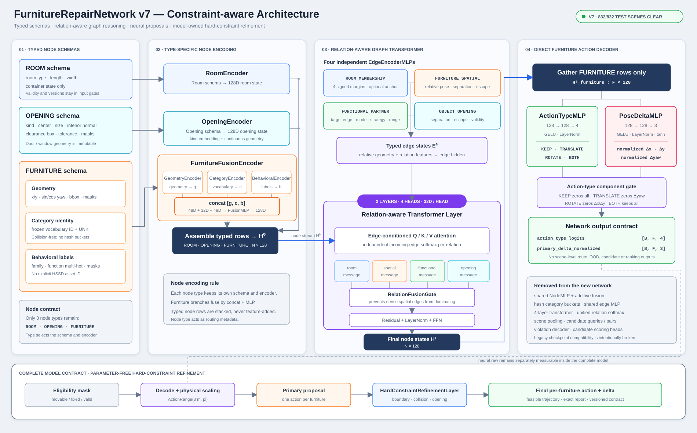

# Furniture 阶段新版网络结构设计 v1

| 项目 | 状态 |
|---|---|
| 设计状态 | 已冻结 |
| 文档日期 | 2026-07-27 |
| 实现状态 | v3 首版代码已实现；SceneExpert 数据与运行时集成待完成 |
| 讨论与证据 | [Furniture阶段网络改进措施_v1.md](Furniture阶段网络改进措施_v1.md) |



## 1. 文档定位

本文档只描述新版 Furniture 布局修复网络的目标结构和接口，不记录讨论过程。设计依据与被拒绝方案见上方讨论文档。

新版网络的职责是：输入一个房间中的 ROOM、OPENING、FURNITURE 及其关系，为每个 Furniture 输出主要的平移/旋转修复建议。v1 神经主干本身不承担候选执行和精确几何验收；从 `furniture_constraint_aware_model_v1` 起，部署模型在主干之后正式持有一个无参数硬约束细化层，在同一个 `repair_batch()` 推理合同中输出最终可执行 action/delta。神经主干 raw 与完整模型指标必须分别报告。

## 2. 设计目标

1. 对未见过的 HSSD asset ID，依靠可迁移语义标签、几何和关系完成修复，不记忆资产编号。
2. ROOM、OPENING、FURNITURE 使用符合各自语义的输入 schema，不共享含义冲突的固定槽位。
3. Furniture–Furniture 使用完整有向图，在当前 `F <= 17` 合同内显式编码全部对象对关系。
4. 四种边使用独立编码器，并避免大量 Furniture 空间边压制 ROOM/OPENING 信息。
5. 使用最小完整深度完成全图关系推理，默认固定为两层 Graph Transformer。
6. Transformer 后直接按 Furniture 节点输出动作类型和主要位姿残差，不再保留旧 candidate-query/scoring 模块。

## 3. 总体结构

```text
ROOM schema ----------------> RoomEncoder --------------------┐
                                                              |
OPENING schema -------------> OpeningEncoder -----------------+--> H0: N x 128
                                                              |        |
FURNITURE geometry ---------> FurnitureGeometryEncoder --┐    |        |
Category ID ----------------> CategoryEncoder ------------+----┘        |
Behavior labels + masks ----> BehavioralEncoder ----------┘             |
                                                                       v
                  4 typed edge sets -> 4 EdgeEncoderMLP          2-layer
                                                                       |
                                                     Relation-aware Graph
                                                            Transformer
                                                                       |
                                                                       v
                                                        H2: N x 128
                                                                       |
                                             gather Furniture rows only
                                                   /                   \
                                                  v                     v
                                      ActionTypeMLP              PoseDeltaMLP
                                      128 -> 128 -> 4            128 -> 128 -> 3
                                                  \                     /
                                                   v                   v
                                      action_type_logits      normalized delta
                                      KEEP/TRANS/ROT/BOTH     dx / dy / dyaw
```

固定主干参数：

| 参数 | 取值 |
|---|---:|
| Node hidden dimension | 128 |
| Graph Transformer layers | 2 |
| Attention heads | 4 |
| Head dimension | 32 |
| Compact edge dimension | 32 |
| Furniture geometry/category/behavior branches | 48 / 32 / 48 |
| Furniture spatial topology | 无自环完整有向图 |

## 4. 节点合同

### 4.1 节点类型

新版只保留三种节点：

| ID | Node type | 职责 |
|---:|---|---|
| 0 | `ROOM` | 房间容器与全局消息汇总节点 |
| 1 | `OPENING` | 门、窗等不可移动开口及其净空约束源 |
| 2 | `FURNITURE` | Furniture 阶段唯一动作输出对象 |

`TASK / WALL / VIOLATION / RELATION_GROUP` 全部删除。node type ID 用于选择类型专属 encoder、构造边方向角色和审计，不再通过独立的 128 维向量与其他分支直接相加。

### 4.2 RoomEncoder

ROOM schema 只保存房间容器自身的信息：

- `room_type` 的冻结词表 ID；
- 房间 `length / width`。

`wall_height`、房间几何有效性、矩形边界合同版本和坐标归一化参数只用于确定性几何计算、输入门禁及 checkpoint 合同校验，不作为默认 learned ROOM feature。对象数和 opening 数可从图结构得到，也不重复编码。`RoomEncoder` 将 ROOM schema 映射为一个 128 维初始状态。

### 4.3 OpeningEncoder

OPENING schema 保存：

- opening kind 的冻结词表 ID；
- clearance box 的中心与尺寸；
- interior normal；
- 逐字段 validity mask。

原始 opening 中心/尺寸只用于构造 clearance box，不与 clearance box 重复进入网络。逐 opening 的 hard/tolerance 当前不是稳定运行时字段，统一由 verifier/checkpoint 合同管理。Opening 自身属性由 `OpeningEncoder` 映射到 128 维；某件 Furniture 相对 Opening 的 signed separation 和 minimum escape vector 写入对应 `OBJECT_OPENING` 边。

### 4.4 FurnitureFusionEncoder

Furniture 初始状态由三个保持来源身份的分支融合：

```text
z_geometry = FurnitureGeometryEncoder(geometry, geometry_masks)
z_category = CategoryEncoder(category_id)
z_behavior = BehavioralEncoder(behavior_fields, behavior_masks)

H0_furniture = LayerNorm(
  FusionMLP(concat(z_geometry, z_category, z_behavior, validity_masks))
)
```

各分支不先扩展到共享 hidden width 后等权相加。geometry/category/behavior 分支分别输出 48/32/48 维，FusionMLP 最终输出 128 维，并在第一次 Graph Attention 前完成统一 LayerNorm。

#### Furniture geometry

本体几何至少包含：

- 当前 room-frame `x / y`；
- `sin(yaw) / cos(yaw)`；
- bbox `width / depth / height`；
- 对应逐字段 validity mask。

`z`、scale、movable/immutable 和 transform-valid 不作为 learned geometry feature：`z` 与 scale 只用于确定性几何，bbox 已反映实际缩放；其余字段用于 eligibility 和输入门禁。semantic front 和交互 clearance 在运行时来源稳定前不进入 v1。相对其他实体的信息不在节点中重复：房间边界量进入 `ROOM_MEMBERSHIP`，opening 相对量进入 `OBJECT_OPENING`，Furniture pair 几何进入 `FURNITURE_SPATIAL`。

#### Geometric yaw contract

v1 只使用对象 canonical transform 中的几何 yaw，不引入 `semantic_front_yaw`、front offset 或对应 validity。yaw 从 `rotation_wxyz` 按统一公式提取，绕 room-frame `+Z`，使用弧度并 wrap 到 `[-pi, pi)`；节点和边分别使用 `sin/cos` 及 wrapped relative yaw。

训练数据构建与 SceneExpert 推理必须冻结相同的 `room_local_z_up` 手性、四元数顺序、yaw 正方向、asset/object frame 变换和提取实现。资产若在适配阶段发生 canonical reorientation，bbox、transform 和 yaw 必须一起变换并升级 schema，禁止只旋转 mesh 或只改角度。没有语义正面的物件不额外标为输入缺失；其 yaw 是否影响修复由 category、family、function、几何上下文和训练监督共同学习。相应地，数据生成器不得仅因方向无意义物件的 yaw 不同就构造必须旋转的目标。

#### Category identity

- 使用冻结、无碰撞的 category vocabulary 与显式 `UNK`。
- 禁止 SHA-256 hash bucket 和运行时动态扩词表。
- CategoryEmbedding 的默认内部宽度为 32 维，经 FusionMLP 后统一到 128 维。
- 未见 category 可退化到 `UNK`，同时继续使用 behavioral descriptor 与几何完成泛化。

#### HSSD behavioral descriptor

HSSD ID 不作为任何 learned embedding 的索引，只用于冻结语义 lookup、asset-disjoint split、provenance 和审计。

BehavioralEncoder 的结构化输入包括：

- family；
- function multi-hot；
- family/function 的逐分支 validity mask。

family 使用小型冻结词表 embedding，function 使用 multi-hot/集合编码。candidate/resolved context、functional detail、semantic role、allowed surface、semantic front、keep-clear、placement DOF、environment anchor、confidence 和 provenance 均不进入 v1 BehavioralEncoder。缺失和“不适用”必须由分支 mask 区分；新版不维持旧 82 维槽位，BehavioralEncoder 输出宽度由消融确定。

所有运行时行为字段必须在数据构建阶段物化到版本化、带 schema/hash 的冻结语义包。训练与推理读取同一份合同；缺包或 hash 不符时显式拒绝，不能静默填零。

## 5. 边合同

### 5.1 边类型与方向

| ID | Edge type | 方向 | 作用 |
|---:|---|---|---|
| 0 | `ROOM_MEMBERSHIP` | ROOM <-> OPENING/FURNITURE | 成员向 ROOM 汇总，ROOM 向成员广播；Furniture–Room 边携带边界 margin |
| 1 | `FURNITURE_SPATIAL` | Furniture -> Furniture | `i != j` 的完整有向图；相对几何和 collision margin |
| 2 | `FUNCTIONAL_PARTNER` | Furniture -> Furniture | 具体 HSSD ID 已标注的 partner 类别候选；关系目标实例由边端点表示 |
| 3 | `OBJECT_OPENING` | Opening -> Furniture | 单向提供 opening 几何和该 Furniture 的 clearance 约束 |

`ROOM_MEMBERSHIP` 内部区分：

- `MEMBER_TO_ROOM`：ROOM 汇总 Furniture/Opening 状态；
- `ROOM_TO_MEMBER`：ROOM 向成员发送房间与全局场景状态。

`OBJECT_OPENING` 不建立 Furniture -> Opening 反向边。Opening 是不可移动约束源，不承担汇总家具后再广播的职责。

### 5.2 Furniture 完整有向图

对 `F` 个 Furniture，为所有 `i != j` 建立 `i -> j`：

```text
E_spatial = F * (F - 1)
```

当前合同 `F <= 17`，最多 272 条 `FURNITURE_SPATIAL` 边。超过合同的场景必须触发显式边预算策略或拒绝，不能静默退回旧 3m 邻域图。

### 5.3 四个独立 EdgeEncoderMLP

四类边分别定义原始字段 schema，并使用独立 MLP：

```text
ROOM_MEMBERSHIP fields   -> RoomMembershipEdgeMLP
FURNITURE_SPATIAL fields -> FurnitureSpatialEdgeMLP
FUNCTIONAL_PARTNER fields-> FunctionalPartnerEdgeMLP
OBJECT_OPENING fields    -> ObjectOpeningEdgeMLP
```

它们先映射到公共 compact edge space，再由每层共享的 edge-key/edge-value projection 使用。不能让含义不同的原始槽位先通过同一个 MLP。

冻结 v1 字段：

| Edge type | v1 输入字段 |
|---|---|
| `ROOM_MEMBERSHIP` | 方向角色；Furniture 到四侧边界的 signed margin；可选 wall-anchor direction/mode 及 anchor validity |
| `FURNITURE_SPATIAL` | room-frame relative XY；relative yaw 的 sin/cos；signed separation；minimum escape XY；validity |
| `FUNCTIONAL_PARTNER` | orientation mode；target strategy；有可靠来源时的 desired gap/range 及其 mask；relation validity |
| `OBJECT_OPENING` | signed separation；minimum escape XY；validity |

`FUNCTIONAL_PARTNER` 的 target object 由有向边的 source/target 端点表达，禁止把对象 ID 作为数值或 learned embedding 输入。空间现状由并行的 `FURNITURE_SPATIAL` 边表达，不在功能边重复。边的物理量使用统一房间尺度或明确单位归一化；hash scalar、hash multihot 和无语义零填充不得进入新合同。

冻结 v1 只读取具体 HSSD ID 自身的 `interaction_clearance.functional_partners.partners`。同 category 资产不继承规则，缺失标注不补全。该字段只证明 source asset 对某 target category 存在 partner 候选，不证明场景中的唯一实例配对；所有匹配实例作为候选边进入图。由于该字段没有稳定提供朝向、策略和距离，冻结 builder 对这三类信息输出 `none / none / invalid gap mask`，不根据当前受损布局推断期望关系。

### 5.4 ACPM 边界

新网络合同不包含任何以 ACPM 命名的必需字段。ACPM 的 functional target 或 wall anchor 只能在对象引用仍有效、关系未过期且训练/推理具有同等构造逻辑时，转成上述来源无关关系；否则对应 relation/anchor validity 为 false，并由 presence mask 排除。

ACPM 可以作为真实 SceneExpert 数据中的可选证据或训练教师，但不能成为模型在普通 HSSD 场景上的必需依赖。关系 provenance 只写审计 sidecar，不进入网络。首选关系来源依次为显式验证的 scene relation、训练/推理共享的冻结确定性规则、经适配器验证的可选 ACPM evidence；任何来源都必须输出相同的版本化关系 schema。

## 6. Relation-aware Graph Transformer

### 6.1 单层计算

对关系类型 `r` 的有向边 `j -> i`：

```text
e_ji^r = EdgeEncoderMLP_r(raw_edge_fields, validity)
       + DirectionRoleEmbedding(source_type, r, target_type)

score_ji^r = Q(h_i) dot (K(h_j) + K_edge(e_ji^r)) / sqrt(d_head)
             + relation_bias_r

m_i^r = sum over j in N_r(i) [
          softmax within relation r (score_ji^r)
          * (V(h_j) + V_edge(e_ji^r))
        ]
```

四类关系先分别进行 incoming-edge softmax，之后融合：

```text
m_i = RelationFusionGate(
        {m_i^ROOM, m_i^SPATIAL, m_i^FUNCTIONAL, m_i^OPENING},
        relation_present_masks,
        h_i
      )

h_i'  = LayerNorm(h_i + Dropout(OutputProjection(m_i)))
h_i'' = LayerNorm(h_i' + Dropout(FFN(h_i')))
```

不存在的关系组由 presence mask 排除，不用伪造零消息参与 gate。

### 6.2 关系分组的必要性

所有入边统一 softmax 时，16 条 Furniture 空间边在相同 logit 下会天然获得约 16 倍于单条 ROOM/OPENING 边的总质量，并随 Furniture 数量变化。relation-wise softmax 消除这种数量先验，RelationFusionGate 再学习每类关系对当前节点的重要性。

### 6.3 两层信息传播

第一层使每个 Furniture 获得所有 Furniture、ROOM、OPENING 的直接信息，并使 ROOM 汇总成员。第二层使用已经包含房间/开口上下文的 Furniture query 再次选择关系，同时完成 `MEMBER_TO_ROOM -> ROOM_TO_MEMBER` 的全局汇总回传。

第三层以后不增加新的可达节点或关系，因此新版固定为两层。1 层和旧 4 层只用于消融，不属于默认结构。

## 7. Furniture 动作头

只 gather Transformer 输出中的 Furniture 行：

```text
H2_furniture: [B, F, 128]
```

### 7.1 ActionTypeMLP

```text
Linear(128, 128)
GELU
LayerNorm(128)
Linear(128, 4)
```

输出：

```text
action_type_logits: [B, F, 4]
classes: KEEP / TRANSLATE / ROTATE / BOTH
```

### 7.2 PoseDeltaMLP

```text
Linear(128, 128)
GELU
LayerNorm(128)
Linear(128, 3)
Tanh
```

输出：

```text
primary_delta_normalized: [B, F, 3]
components: normalized_dx / normalized_dy / normalized_dyaw
```

动作范围从版本化 dataset/checkpoint contract 读取：

```text
dx_m = normalized_dx * max_translation_m
dy_m = normalized_dy * max_translation_m
dyaw_rad = normalized_dyaw * max_yaw_rad
```

当前代码中的 `0.4m/45deg` 与部分数据 metadata 中的 `0.55m/60deg` 必须在实现前统一；网络、loss、decoder 不得分别硬编码。

### 7.3 动作门控

| Action type | 实际执行 delta |
|---|---|
| `KEEP` | `(0, 0, 0)` |
| `TRANSLATE` | `(dx, dy, 0)` |
| `ROTATE` | `(0, 0, dyaw)` |
| `BOTH` | `(dx, dy, dyaw)` |

`movable/immutable/transform-valid` 是确定性资格门禁，在动作头外执行。不可移动或 transform 无效对象强制 KEEP，不让网络学习硬安全规则。

### 7.4 明确不输出的信息

- 不输出独立 ChangeCountHead；数量由逐节点非 KEEP 结果派生。
- 不输出无监督 mixture、scale 或 kappa。
- 不输出独立 confidence/OOD 标量冒充认知不确定性。
- 不预测碰撞是否解除、是否越界或 opening clearance 是否满足。
- 不输出 candidate validity/quality/ranking。

## 8. 训练目标

### 8.1 动作类型损失

按动作合同中冻结的 translation/yaw epsilon 对目标 delta 生成四类标签：

- 未改变：`KEEP`；
- 仅 XY 非零：`TRANSLATE`；
- 仅 yaw 非零：`ROTATE`；
- XY 与 yaw 均非零：`BOTH`。

使用带类别权重的 4 类 Cross-Entropy。`move_probability` 可由 `1 - P(KEEP)` 派生。

### 8.2 位姿损失

- `TRANSLATE/BOTH`：对真实米制 `dx/dy` 使用 Smooth-L1；
- `ROTATE/BOTH`：使用周期损失 `1 - cos(pred_yaw - target_yaw)`；
- `KEEP`：不参与目标位姿回归，只施加轻量 zero-delta 正则；
- 所有位姿损失受 pose-valid 和确定性 eligibility mask 控制。

### 8.3 数据划分与泛化验收

- validation/test 必须按 HSSD asset ID 严格隔离；
- 分别报告“未见 ID、标签已见”“未见标签组合”“标签缺失/冲突”；
- 不以随机 episode split 证明未见资产泛化；
- 检查每类动作的 precision/recall、translation error、yaw error，以及应用动作后的 verifier hard-valid rate。

当前旧数据只有单一有效 target cluster，不能证明多峰动作学习能力。新版第一阶段只学习每个 Furniture 的主要动作建议；未来若获得多个经 Verifier 确认的等价目标，再单独设计多解模型。

## 9. 网络外执行边界

网络输出经过以下确定性流程：

```text
action_type_logits + normalized delta
  -> eligibility mask
  -> action-type component gate
  -> physical range scaling
  -> primary RepairCandidate
  -> Executor dry-run / transactional apply
  -> FurnitureVerifier
  -> accept or rollback / escalate
```

KEEP 可由所有 Furniture 均预测 KEEP 得到。输入 schema/hash 不匹配、非法 room geometry、非有限 transform、超出节点/边预算等情况由数据门禁直接拒绝或 ESCALATE，不依赖神经网络 route head。

如需生成多个候选，应在网络输出之后围绕 primary action 做有界、可审计的候选扩展，并逐个经过 Verifier；该策略不属于本文定义的新版神经网络主体。

## 10. 删除的旧模块

| 旧模块 | 新版处理 |
|---|---|
| Shared `NodeMLP(48->256)` | 删除；改为三种类型专属 encoder |
| `NodeTypeEmbedding + CategoryEmbedding + HSSDMLP` 直接相加 | 删除；改为 Furniture concat + FusionMLP |
| Category 512 hash buckets | 删除；改为冻结无碰撞词表 + UNK |
| HSSD asset-ID embedding | 禁止 |
| Shared 16D edge MLP | 删除；改为四个独立 EdgeEncoderMLP |
| 全部入边统一 softmax | 删除；改为 relation-wise softmax + gate |
| 4-layer Graph Transformer | 改为固定 2 层 |
| `[task H; room H; mean(H)]` scene pooling | 删除 |
| Route/OOD scene heads | 从动作网络删除；硬门禁与 OOD 另行处理 |
| Learned candidate queries/context | 删除 |
| Candidate–Furniture pair tensor | 删除 |
| Translation/Yaw mixture expectation | 删除 |
| Violation decoder | 删除 |
| 10D candidate summary | 删除 |
| Validity/soft-gain/ranking heads | 删除；最终合法性由 Verifier 判断 |

## 11. 张量接口摘要

| 阶段 | Tensor | Shape |
|---|---|---|
| 类型专属节点编码 | `H0` | `[B, N, 128]` 或 disjoint `[N_total,128]` |
| 两层图编码 | `H2` | 同 `H0` |
| Furniture gather | `H2_furniture` | `[B,F,128]` |
| 动作分类 | `action_type_logits` | `[B,F,4]` |
| 位姿残差 | `primary_delta_normalized` | `[B,F,3]` |

必须随 checkpoint 固化：node/edge vocabulary、category vocabulary hash、behavior schema/hash、各类型节点/边 schema version、hidden/heads/layers、动作范围合同，以及 geometric-yaw 坐标系、四元数顺序、提取与 wrap 约定。任一关键合同不匹配时禁止静默加载。

## 12. 实现顺序

1. 冻结三类 node schema、四类 edge schema 与 category/behavior 词表合同。
2. 实现三个类型专属节点 encoder 和 FurnitureFusionEncoder。
3. 实现四个 EdgeEncoderMLP、direction role 与 relation-wise aggregation。
4. 将 Graph Transformer 固定为两层并完成张量/梯度测试。
5. 实现两个 Furniture 动作 MLP 和门控损失。
6. 删除旧 scene/candidate/violation/scoring 分支及对应训练目标。
7. 重建数据集与 checkpoint schema，不直接迁移旧 edge/node ID 权重。
8. 完成 asset-disjoint 离线评估、Verifier 回放和 Shadow 验证。
